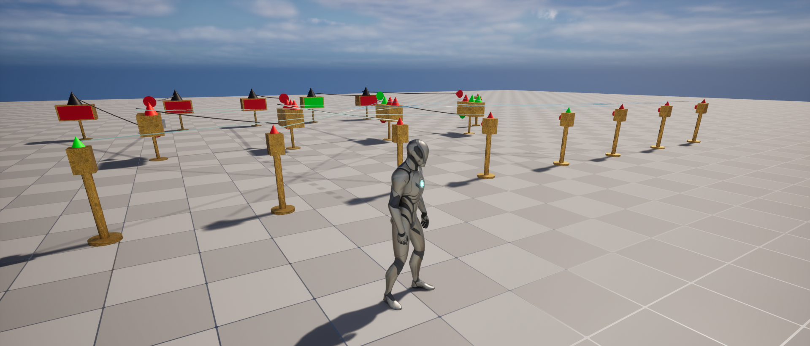

# Logic Gates (Unreal Engine 5)

---

### Introduction

After many years of tinkering with Fallout 4 mods, I came across the mod Complex Logic Circuits, which is a mod built 
upon the Advanced Settlement Power mod. This is a way of using the built in Logic-Gates in Fallout 4, in order to create 
more complex logic circuits, as the name implies. 

This project is a culmination of many different projects I've spun up. Initially I was able to simulate logic circuits 
using C++ only, but as my circuits grew more complex, I eventually got to the point that I wanted to try 
memory, or RAM. The problem there was, for any given RAM, I would almost invariably need to have some sort of system in 
place for Tri-State logic. Beyond this, I learned that the best way to handle state propagation was using the Observer 
Pattern. This way, when we flip a switch, for example, all connected nodes to that switch will process this state change 
accordingly.

Moving my C++ Project over to Unreal Engine wasn't trivial. For starters, we have to find a way to change the color of 
our mesh, when we toggle its state. I went with Black for Disabled, Red for Off, and Green for On. Furthermore, we want
to connect the nodes similar to the way it's done in Fallout 4. So far, I haven't come up with a viable solution for 
this, but I've got some ideas, and I'll stick to it, until I've got something working! 

---

### Tri-State Logic 

We have three states. These somewhat loosely correspond with real digital logic circuits. When we've got our node 
disabled, this would be something like leaving the input floating. It's neither Logic 0 or Logic 1. Rather, it's simply 
not connected to anything. With the other two states, On and Off, they correspond with the boolean values of true and 
false.

---

### Observer Pattern

The observer pattern is essential for our project. We essentially have two concepts. The subject or publisher, and the 
observer or subscriber. When we make a change, we want to notify all of our connected observers, so they will react 
accordingly. Similarly, when we connect up our nodes, we want to attach them appropriately, so there is a reference to 
them in their corresponding subjects. 

---
